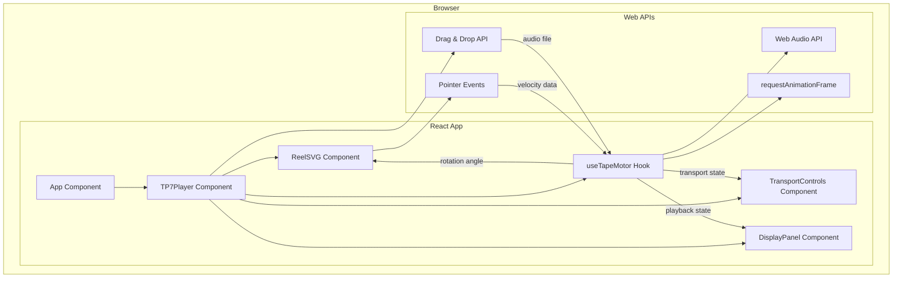
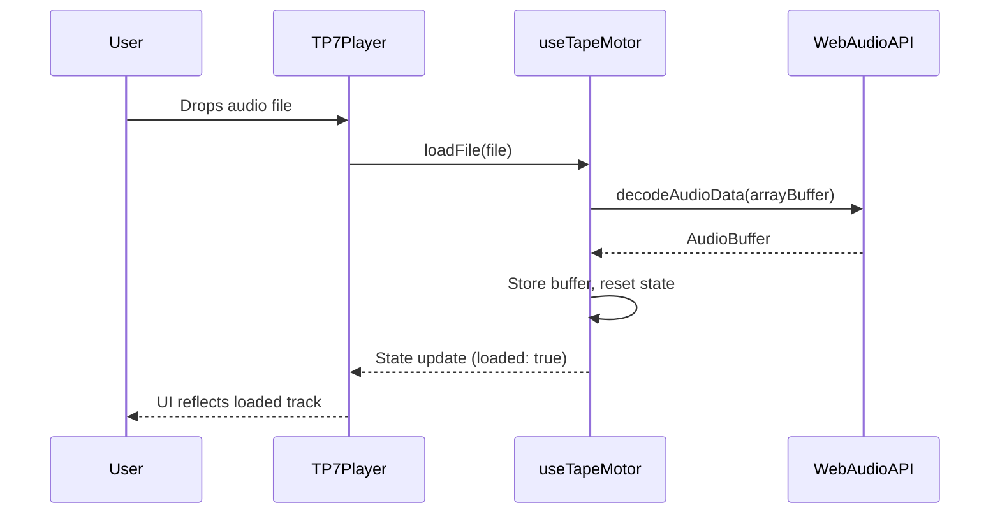
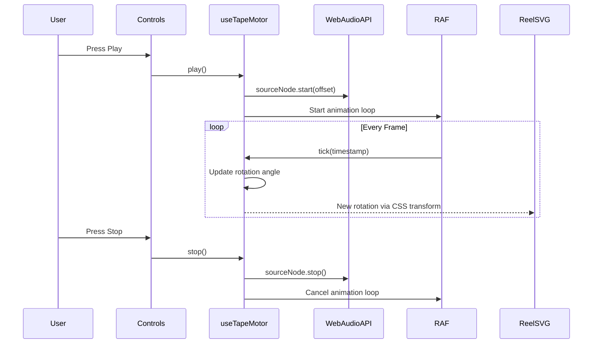
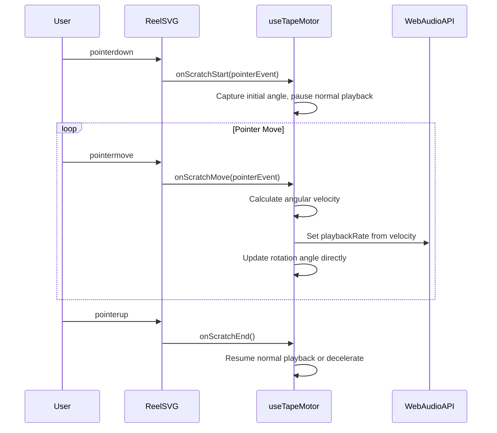

# Design Document: TP-7 Audio Player

## Overview

This project is a web-based, interactive 2D replica of the Teenage Engineering TP-7 audio player, built as a modern React/TypeScript single-page application. The core architecture revolves around a single custom hook — `useTapeMotor` — that serves as the unified source of truth for both Web Audio API state (playback, speed, file loading) and the physics/visual state (reel rotation, pointer velocity, animation frames).

The UI is highly skeuomorphic, using CSS and inline SVGs to replicate the physical TP-7's aesthetic. The application faithfully replicates three key mechanical interactions from the hardware:

1. **Motorized Center Reel** — The reel spins in sync with audio playback. Clicking the center hub triggers a "tape stop" effect (200ms deceleration ramp). Dragging the outer edge scratches the audio with angular velocity mapped to playbackRate.
2. **Side Rocker** — A navigation rocker on the left edge provides fast-forward (2×/4×/8×) and rewind. Holding the rocker while dragging the reel enables "combo scrub" mode for precise timeline navigation.
3. **Hardware Detailing** — OLED-style monochrome display, chunky mechanical transport switches (Record/Play/Stop), and I/O port silhouettes (3× TRRS + main out) on the right edge.

This is a greenfield project using Vite + React + TypeScript with zero runtime dependencies beyond React itself. All audio processing uses the native Web Audio API.

## Architecture



## Sequence Diagrams

### File Loading via Drag-and-Drop



### Playback & Reel Animation



### Scratch Interaction (Pointer Drag on Reel)



## Components and Interfaces

### Component 1: TP7Player

**Purpose**: Root container that composes the skeuomorphic player UI, handles drag-and-drop file loading, and wires the `useTapeMotor` hook to child components. Arranges the side rocker (left), main chassis (center), and I/O ports (right) in a horizontal layout.

```typescript
interface TP7PlayerProps {
  className?: string;
}
```

**Responsibilities**:
- Render the player chassis (skeuomorphic housing)
- Handle drag-and-drop events for audio file loading
- Instantiate `useTapeMotor` and distribute state to children
- Compose ReelSVG, TransportControls, DisplayPanel, SideRocker, and IOPorts

### Component 2: ReelSVG

**Purpose**: Renders the spinning tape reel as an SVG element with two interaction zones: center hub (tape stop) and outer edge (scratch).

```typescript
interface ReelSVGProps {
  rotationDeg: number;
  onScratchStart: (e: PointerEvent) => void;
  onScratchMove: (e: PointerEvent) => void;
  onScratchEnd: () => void;
  onTapeStopStart: () => void;
  onTapeStopEnd: () => void;
  isSpinning: boolean;
  isScratchActive: boolean;
  isTapeStopped: boolean;
}
```

**Responsibilities**:
- Render the reel SVG with spokes/hub detail
- Detect click zone (center < 30% radius = tape stop, outer = scratch)
- Apply `transform: rotate(${rotationDeg}deg)` on each frame
- Attach pointer event listeners
- Visual feedback for tape stop and scratch states

### Component 3: SideRocker

**Purpose**: A vertical rocker mechanism on the left edge for fast-forward/rewind navigation.

```typescript
interface SideRockerProps {
  isLoaded: boolean;
  rockerSpeed: number;
  onRockerPress: (direction: 'ff' | 'rw') => void;
  onRockerRelease: () => void;
}
```

**Responsibilities**:
- Render top (FF) and bottom (RW) rocker halves
- Show current speed multiplier when active
- Disable when no file is loaded
- Support repeated presses to increment speed (2×→4×→8×)

### Component 4: TransportControls

**Purpose**: Record, Play, and Stop controls styled as chunky mechanical switches.

```typescript
interface TransportControlsProps {
  isPlaying: boolean;
  isLoaded: boolean;
  onPlay: () => void;
  onPause: () => void;
  onStop: () => void;
}
```

**Responsibilities**:
- Render skeuomorphic transport buttons
- Disable controls when no file is loaded
- Visual active/pressed states

### Component 4: DisplayPanel

**Purpose**: Shows track info, current time, and playback rate — styled as a monochrome OLED display.

```typescript
interface DisplayPanelProps {
  currentTime: number;
  duration: number;
  playbackRate: number;
  fileName: string | null;
  isLoaded: boolean;
  error: string | null;
  isRockerHeld: boolean;
  isTapeStopped: boolean;
}
```

**Responsibilities**:
- Render time in MM:SS.ms format
- Show playback rate indicator with direction arrow
- Display file name or "— NO TAPE —" when empty
- Show status badges for STOP and SCRUB modes

### Component 5: IOPorts

**Purpose**: Visual representation of the TP-7's right-edge I/O ports (3× stereo TRRS jacks + main out/headphone).

**Responsibilities**:
- Render port holes with labels matching hardware silhouette
- Purely decorative — no interactive behavior

## Data Models

### TapeMotorState

```typescript
interface TapeMotorState {
  // Audio state
  isLoaded: boolean;
  isPlaying: boolean;
  fileName: string | null;
  duration: number;
  currentTime: number;
  playbackRate: number;
  error: string | null;

  // Physics/visual state
  rotationDeg: number;
  isScratchActive: boolean;

  // Tape stop state
  isTapeStopped: boolean;

  // Rocker state
  rockerSpeed: number; // 0 = neutral, positive = FF, negative = RW
  isRockerHeld: boolean;
  isComboScrubbing: boolean;
}
```

**Validation Rules**:
- `playbackRate` must be in range [-8.0, 8.0] (extended for rocker FF/RW)
- `rotationDeg` wraps at 360° (always in [0, 360))
- `currentTime` clamped to [0, duration]
- `duration` is 0 when no file is loaded
- `rockerSpeed` is one of: -8, -4, -2, 0, 2, 4, 8

### TapeStopState (internal to hook)

```typescript
interface TapeStopState {
  isActive: boolean;
  wasPlayingBefore: boolean;
  rampStartTime: number;
  rampStartRate: number;
}
```

### RockerState (internal to hook)

```typescript
interface RockerState {
  isHeld: boolean;
  direction: 'ff' | 'rw' | null;
  speedLevel: number; // 0, 2, 4, 8
}
```

### ScratchState (internal to hook)

```typescript
interface ScratchState {
  isActive: boolean;
  startAngle: number;       // Angle at pointerdown (radians from reel center)
  lastAngle: number;        // Previous frame's angle
  lastTimestamp: number;    // Previous frame's timestamp (ms)
  velocity: number;         // Angular velocity (rad/s)
  accumulatedRotation: number; // Total rotation during scratch
}
```

### AudioEngineRefs (internal to hook)

```typescript
interface AudioEngineRefs {
  audioContext: AudioContext | null;
  sourceNode: AudioBufferSourceNode | null;
  audioBuffer: AudioBuffer | null;
  startOffset: number;      // Where playback started from (seconds)
  startTime: number;        // AudioContext.currentTime when started
}
```

## Algorithmic Pseudocode

### Main Animation Loop

```typescript
ALGORITHM animationLoop(timestamp: DOMHighResTimeStamp)
INPUT: timestamp from requestAnimationFrame
OUTPUT: Updated rotationDeg and currentTime in state

BEGIN
  IF NOT state.isPlaying AND NOT state.isScratchActive THEN
    RETURN  // No animation needed
  END IF

  IF state.isPlaying AND NOT state.isScratchActive THEN
    // Normal playback: derive rotation from audio time
    elapsed ← (audioContext.currentTime - refs.startTime) * state.playbackRate
    currentTime ← refs.startOffset + elapsed

    IF currentTime >= state.duration THEN
      stop()
      RETURN
    END IF

    // Map time to rotation: one full revolution per second at rate 1.0
    rotationDeg ← (currentTime * 360 * state.playbackRate) MOD 360
    
    setState({ currentTime, rotationDeg })
  END IF

  rafId ← requestAnimationFrame(animationLoop)
END
```

**Preconditions:**
- `audioContext` is initialized and not in "suspended" state
- `state.isPlaying` or `state.isScratchActive` is true

**Postconditions:**
- `rotationDeg` is in [0, 360)
- `currentTime` is in [0, duration]
- Next animation frame is scheduled if still active

**Loop Invariants:**
- `rotationDeg` always reflects the current audio position
- `currentTime` monotonically increases during normal playback

### Scratch Velocity Calculation

```typescript
ALGORITHM calculateScratchVelocity(event: PointerEvent, reelCenter: Point)
INPUT: pointer event with clientX/clientY, center of reel element
OUTPUT: angular velocity in radians/second, mapped playbackRate

BEGIN
  // Calculate angle from reel center to pointer
  dx ← event.clientX - reelCenter.x
  dy ← event.clientY - reelCenter.y
  currentAngle ← atan2(dy, dx)

  // Calculate angular delta (handle wraparound)
  deltaAngle ← currentAngle - scratchState.lastAngle
  
  IF deltaAngle > π THEN
    deltaAngle ← deltaAngle - 2π
  ELSE IF deltaAngle < -π THEN
    deltaAngle ← deltaAngle + 2π
  END IF

  // Calculate velocity
  deltaTime ← (event.timeStamp - scratchState.lastTimestamp) / 1000
  
  IF deltaTime > 0 THEN
    rawVelocity ← deltaAngle / deltaTime
    // Smooth with exponential moving average
    velocity ← 0.3 * rawVelocity + 0.7 * scratchState.velocity
  ELSE
    velocity ← scratchState.velocity
  END IF

  // Map angular velocity to playbackRate
  // Full rotation per second (2π rad/s) = playbackRate 1.0
  playbackRate ← clamp(velocity / (2 * π), -4.0, 4.0)

  // Update scratch state
  scratchState.lastAngle ← currentAngle
  scratchState.lastTimestamp ← event.timeStamp
  scratchState.velocity ← velocity

  RETURN { velocity, playbackRate }
END
```

**Preconditions:**
- `scratchState.isActive` is true
- `reelCenter` is a valid point within the viewport
- Previous angle and timestamp have been recorded

**Postconditions:**
- `playbackRate` is in [-4.0, 4.0]
- `velocity` is smoothed (no sudden jumps)
- `scratchState` is updated with latest values

**Loop Invariants:**
- Angular delta correctly handles the ±π wraparound boundary
- Exponential moving average converges toward actual velocity

### File Loading Algorithm

```typescript
ALGORITHM loadFile(file: File)
INPUT: File object from drag-and-drop or file input
OUTPUT: Decoded AudioBuffer stored in state, ready for playback

BEGIN
  ASSERT file.type starts with "audio/"

  // Initialize AudioContext on first interaction (browser policy)
  IF refs.audioContext IS NULL THEN
    refs.audioContext ← new AudioContext()
  END IF

  IF refs.audioContext.state = "suspended" THEN
    AWAIT refs.audioContext.resume()
  END IF

  // Stop any current playback
  IF state.isPlaying THEN
    stop()
  END IF

  // Decode the file
  arrayBuffer ← AWAIT file.arrayBuffer()
  audioBuffer ← AWAIT refs.audioContext.decodeAudioData(arrayBuffer)

  // Store and update state
  refs.audioBuffer ← audioBuffer
  refs.startOffset ← 0

  setState({
    isLoaded: true,
    fileName: file.name,
    duration: audioBuffer.duration,
    currentTime: 0,
    rotationDeg: 0,
    playbackRate: 1.0
  })
END
```

**Preconditions:**
- `file` is a valid File object with an audio MIME type
- Browser supports Web Audio API

**Postconditions:**
- `refs.audioBuffer` contains decoded audio data
- `state.isLoaded` is true
- `state.duration` equals the audio file's duration in seconds
- Any previous playback is stopped

## Key Functions with Formal Specifications

### useTapeMotor()

```typescript
function useTapeMotor(): TapeMotorAPI

interface TapeMotorAPI {
  // State (read-only)
  state: TapeMotorState;

  // Transport controls
  play(): void;
  pause(): void;
  stop(): void;

  // File management
  loadFile(file: File): Promise<void>;

  // Scratch interaction handlers (outer edge drag)
  onScratchStart(e: React.PointerEvent, reelCenter: Point): void;
  onScratchMove(e: React.PointerEvent, reelCenter: Point): void;
  onScratchEnd(): void;

  // Tape stop (center hub press & hold)
  onTapeStopStart(): void;
  onTapeStopEnd(): void;

  // Side rocker (FF/RW navigation)
  onRockerPress(direction: 'ff' | 'rw'): void;
  onRockerRelease(): void;
}
```

**Preconditions:**
- Called within a React functional component
- Browser supports Web Audio API and Pointer Events

**Postconditions:**
- Returns a stable API object (methods don't change identity between renders)
- `state` reflects the current unified audio + physics state
- All methods safely handle being called in any order

### play()

```typescript
function play(): void
```

**Preconditions:**
- `state.isLoaded` is true (audioBuffer exists)
- `state.isPlaying` is false
- `state.isScratchActive` is false

**Postconditions:**
- New `AudioBufferSourceNode` is created and started at `startOffset`
- `state.isPlaying` is true
- Animation loop is running via `requestAnimationFrame`
- `playbackRate` is set to current `state.playbackRate`

### stop()

```typescript
function stop(): void
```

**Preconditions:**
- `state.isLoaded` is true

**Postconditions:**
- `sourceNode` is stopped and disconnected
- `state.isPlaying` is false
- `state.currentTime` is 0
- `refs.startOffset` is 0
- Animation loop is cancelled
- `state.rotationDeg` is 0

### pause()

```typescript
function pause(): void
```

**Preconditions:**
- `state.isPlaying` is true

**Postconditions:**
- `sourceNode` is stopped and disconnected
- `state.isPlaying` is false
- `refs.startOffset` is set to current `state.currentTime` (resume point)
- Animation loop is cancelled
- `state.rotationDeg` retains its current value

### onScratchStart(e, reelCenter)

```typescript
function onScratchStart(e: React.PointerEvent, reelCenter: Point): void
```

**Preconditions:**
- `state.isLoaded` is true
- Pointer event is from a primary button (e.button === 0)

**Postconditions:**
- `state.isScratchActive` is true
- If was playing: playback paused, position saved
- `scratchState` initialized with current angle and timestamp
- Pointer capture is set on the reel element

### onScratchMove(e, reelCenter)

```typescript
function onScratchMove(e: React.PointerEvent, reelCenter: Point): void
```

**Preconditions:**
- `state.isScratchActive` is true
- `scratchState` has valid previous angle/timestamp

**Postconditions:**
- `state.playbackRate` updated based on angular velocity
- `state.rotationDeg` updated to follow pointer
- `state.currentTime` adjusted based on scratch delta
- Audio source `playbackRate` property updated in real-time

### onScratchEnd()

```typescript
function onScratchEnd(): void
```

**Preconditions:**
- `state.isScratchActive` is true

**Postconditions:**
- `state.isScratchActive` is false
- Pointer capture released
- If was playing before scratch: playback resumes from new position
- `state.playbackRate` returns to 1.0

## Example Usage

```typescript
// App.tsx - Root component
import { TP7Player } from './components/TP7Player';

function App() {
  return (
    <div className="app">
      <TP7Player />
    </div>
  );
}

// TP7Player.tsx - Main player component
import { useTapeMotor } from '../hooks/useTapeMotor';
import { ReelSVG } from './ReelSVG';
import { TransportControls } from './TransportControls';
import { DisplayPanel } from './DisplayPanel';

function TP7Player() {
  const motor = useTapeMotor();
  const reelRef = useRef<SVGSVGElement>(null);

  const handleDrop = async (e: React.DragEvent) => {
    e.preventDefault();
    const file = e.dataTransfer.files[0];
    if (file && file.type.startsWith('audio/')) {
      await motor.loadFile(file);
    }
  };

  const getReelCenter = (): Point => {
    const rect = reelRef.current!.getBoundingClientRect();
    return { x: rect.left + rect.width / 2, y: rect.top + rect.height / 2 };
  };

  return (
    <div className="tp7-chassis" onDrop={handleDrop} onDragOver={e => e.preventDefault()}>
      <DisplayPanel
        currentTime={motor.state.currentTime}
        duration={motor.state.duration}
        playbackRate={motor.state.playbackRate}
        fileName={motor.state.fileName}
        isLoaded={motor.state.isLoaded}
      />
      <ReelSVG
        ref={reelRef}
        rotationDeg={motor.state.rotationDeg}
        isSpinning={motor.state.isPlaying}
        onScratchStart={(e) => motor.onScratchStart(e, getReelCenter())}
        onScratchMove={(e) => motor.onScratchMove(e, getReelCenter())}
        onScratchEnd={() => motor.onScratchEnd()}
      />
      <TransportControls
        isPlaying={motor.state.isPlaying}
        isLoaded={motor.state.isLoaded}
        onPlay={() => motor.play()}
        onPause={() => motor.pause()}
        onStop={() => motor.stop()}
      />
    </div>
  );
}

// useTapeMotor.ts - Hook usage pattern
function useTapeMotor(): TapeMotorAPI {
  const [state, setState] = useState<TapeMotorState>(INITIAL_STATE);
  const refs = useRef<AudioEngineRefs>(INITIAL_REFS);
  const scratchRef = useRef<ScratchState>(INITIAL_SCRATCH);
  const rafRef = useRef<number | null>(null);

  // Animation loop bound to component lifecycle
  const tick = useCallback((timestamp: DOMHighResTimeStamp) => {
    // ... animation logic from algorithm above
    rafRef.current = requestAnimationFrame(tick);
  }, []);

  // Cleanup on unmount
  useEffect(() => {
    return () => {
      if (rafRef.current) cancelAnimationFrame(rafRef.current);
      refs.current.audioContext?.close();
    };
  }, []);

  return { state, play, pause, stop, loadFile, onScratchStart, onScratchMove, onScratchEnd };
}
```

## Correctness Properties

*A property is a characteristic or behavior that should hold true across all valid executions of a system — essentially, a formal statement about what the system should do. Properties serve as the bridge between human-readable specifications and machine-verifiable correctness guarantees.*

### Property 1: State Bounds Invariant

*For any* sequence of operations (play, pause, stop, scratch, load), the following bounds SHALL hold simultaneously: `playbackRate` is in [-4.0, 4.0], `currentTime` is in [0, duration], and `rotationDeg` is in [0, 360).

**Validates: Requirements 3.4, 5.1, 5.2**

### Property 2: Rotation-Time Synchronization

*For any* point in time during normal playback (not scratching), `rotationDeg` SHALL be derivable from `currentTime` and `playbackRate` — they never drift apart.

**Validates: Requirements 3.1**

### Property 3: State Machine Consistency

*For any* sequence of user actions (load, play, pause, stop, scratch start, scratch end), the player SHALL always be in exactly one of the states: idle, playing, paused, or scratching.

**Validates: Requirements 7.1**

### Property 4: Idempotent Controls

*For any* player state, calling `play()` when already playing or `stop()` when already stopped SHALL produce no state change and no errors.

**Validates: Requirements 2.5, 2.6**

### Property 5: File Loading Produces Correct State

*For any* valid audio file, after successful loading the state SHALL reflect `isLoaded=true`, the correct file name, the correct duration, `currentTime=0`, and `rotationDeg=0`.

**Validates: Requirements 1.1, 1.2**

### Property 6: Invalid Files Are Rejected

*For any* file with a non-audio MIME type or any file that fails decoding, the player state SHALL remain unchanged after the attempted load.

**Validates: Requirements 1.3, 1.5**

### Property 7: Stop Resets to Zero

*For any* player state where a file is loaded (playing, paused, or scratching at any time position), calling `stop()` SHALL result in `currentTime=0` and `rotationDeg=0`.

**Validates: Requirements 2.3**

### Property 8: Pause Preserves Position

*For any* playing state at any `currentTime` value, calling `pause()` SHALL preserve that `currentTime` as the resume offset and retain the current `rotationDeg`.

**Validates: Requirements 2.2**

### Property 9: Scratch Velocity Calculation

*For any* sequence of pointer positions and timestamps during scratch mode, the calculated `playbackRate` SHALL equal the angular velocity (with EMA smoothing factor 0.3/0.7) divided by 2π, clamped to [-4.0, 4.0].

**Validates: Requirements 4.2, 5.3**

### Property 10: Scratch Entry Pauses Playback

*For any* loaded state (playing or paused), initiating a scratch interaction SHALL result in `isScratchActive=true` and normal playback paused.

**Validates: Requirements 4.1**

### Property 11: Scratch Exit Resumes If Was Playing

*For any* scratch state that was entered from a playing state, releasing the pointer SHALL resume playback from the new position.

**Validates: Requirements 4.4**

### Property 12: End-of-Track Stops Playback

*For any* playing state, when `currentTime` reaches or exceeds `duration`, the player SHALL transition to stopped state with `currentTime=0`.

**Validates: Requirements 5.4**

### Property 13: Time Formatting

*For any* time value in seconds (0 to any reasonable duration), the Display_Panel time formatter SHALL produce a string matching the MM:SS pattern.

**Validates: Requirements 6.1**

### Property 14: Loading During Playback Stops Current

*For any* playing state, dropping a new valid audio file SHALL stop the current playback before loading the new file.

**Validates: Requirements 1.4**

## Error Handling

### Error Scenario 1: Invalid Audio File

**Condition**: User drops a non-audio file or a corrupted audio file
**Response**: `decodeAudioData` rejects; catch the error, set state to show error message in DisplayPanel
**Recovery**: State remains in `idle`/previous state; user can drop another file

### Error Scenario 2: AudioContext Suspended

**Condition**: Browser requires user gesture to start AudioContext (autoplay policy)
**Response**: On first `play()` or `loadFile()`, call `audioContext.resume()` before proceeding
**Recovery**: Transparent to user — operation proceeds after resume

### Error Scenario 3: Playback Reaches End

**Condition**: `currentTime >= duration` during animation loop
**Response**: Call `stop()` to reset state, cancel animation
**Recovery**: Player returns to stopped state at time 0; user can play again

### Error Scenario 4: Rapid Pointer Events

**Condition**: Very fast pointer movement produces deltaTime ≈ 0
**Response**: Skip velocity calculation when deltaTime < 1ms, use previous velocity
**Recovery**: Smoothing via exponential moving average prevents jitter

### Error Scenario 5: Component Unmount During Playback

**Condition**: React unmounts TP7Player while audio is playing
**Response**: Cleanup effect stops source node, closes AudioContext, cancels RAF
**Recovery**: All resources freed, no orphaned callbacks

## Testing Strategy

### Unit Testing Approach

Test the `useTapeMotor` hook in isolation using `@testing-library/react-hooks` (or `renderHook` from `@testing-library/react`):

- **State transitions**: Verify play/pause/stop cycle produces correct state sequences
- **File loading**: Mock `decodeAudioData`, verify state updates after load
- **Bounds checking**: Verify playbackRate clamping, time clamping
- **Idempotency**: Verify double-play, double-stop don't corrupt state

### Property-Based Testing Approach

**Property Test Library**: fast-check

- **Rotation bounds**: For any sequence of operations, `rotationDeg` is always in [0, 360)
- **Time bounds**: For any sequence of operations, `currentTime` is in [0, duration]
- **Rate bounds**: For any scratch velocity input, `playbackRate` is in [-4.0, 4.0]
- **Angle wraparound**: For any two angles, `deltaAngle` is always in (-π, π]
- **State machine**: For any sequence of actions, the player is in exactly one valid state

### Integration Testing Approach

- **Drag-and-drop flow**: Simulate file drop → verify audio loads → play → verify reel spins
- **Scratch interaction**: Simulate pointer events → verify playbackRate changes → verify rotation follows pointer
- **Full lifecycle**: Load → play → scratch → release → verify resume → stop → verify cleanup

## Performance Considerations

- **requestAnimationFrame**: All visual updates happen in RAF callbacks (60fps cap), never in React state updates that trigger re-renders
- **Minimal re-renders**: `rotationDeg` is applied via ref + direct DOM manipulation (`element.style.transform`), NOT via React state, to avoid 60fps re-renders of the entire tree
- **Pointer event throttling**: Scratch velocity uses the event's native timestamp, not additional throttling, since pointer events are already coalesced by the browser
- **AudioBufferSourceNode reuse**: Each play creates a new source node (required by Web Audio API spec — nodes are single-use), but the decoded `AudioBuffer` is reused
- **CSS will-change**: The reel SVG element uses `will-change: transform` to promote to its own compositor layer

## Security Considerations

- **File validation**: Only accept files with `audio/*` MIME type from drag-and-drop
- **No network requests**: All processing is local — no audio files are uploaded anywhere
- **AudioContext policy**: Respect browser autoplay policies by only creating/resuming AudioContext on user gesture
- **Pointer capture**: Use `setPointerCapture` to prevent pointer events from leaking to other elements during scratch

## Dependencies

| Dependency | Purpose | Version |
|-----------|---------|---------|
| React | UI framework | ^18.2.0 |
| React DOM | DOM rendering | ^18.2.0 |
| TypeScript | Type safety | ^5.3.0 |
| Vite | Build tool & dev server | ^5.0.0 |
| @testing-library/react | Hook & component testing | ^14.0.0 |
| fast-check | Property-based testing | ^3.15.0 |
| vitest | Test runner | ^1.0.0 |

No additional runtime dependencies. The Web Audio API, Pointer Events, and requestAnimationFrame are all native browser APIs.
